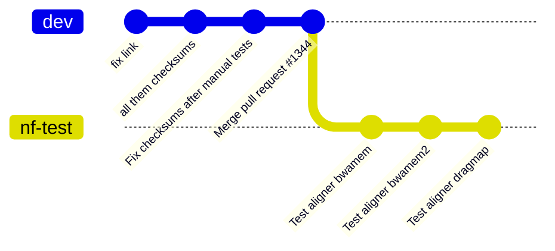
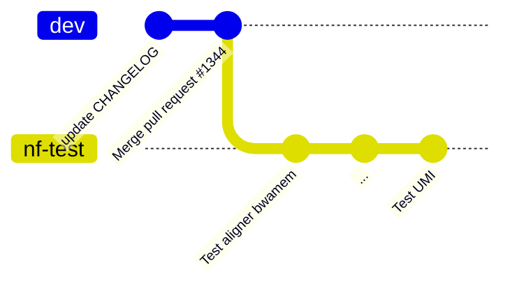
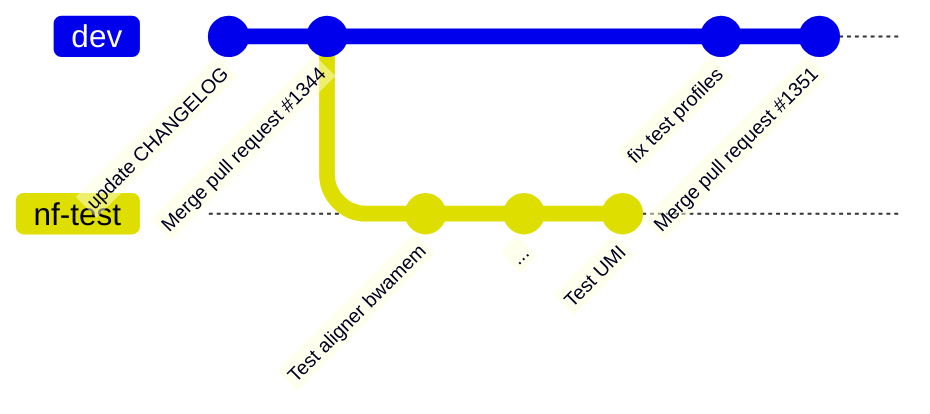
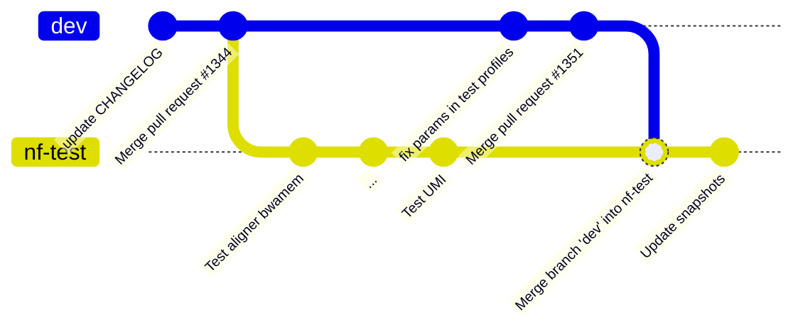
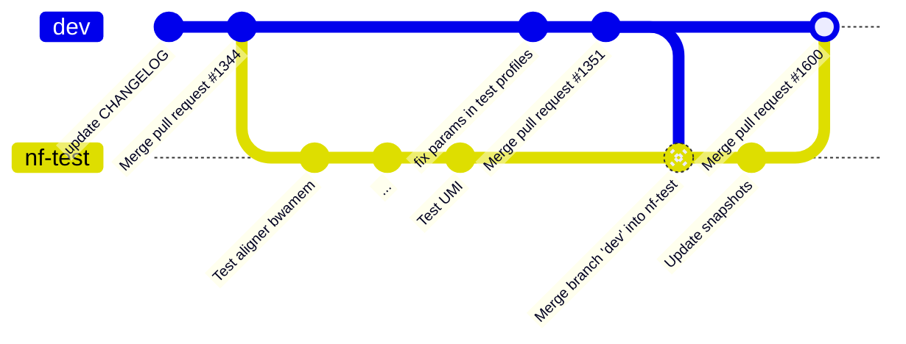
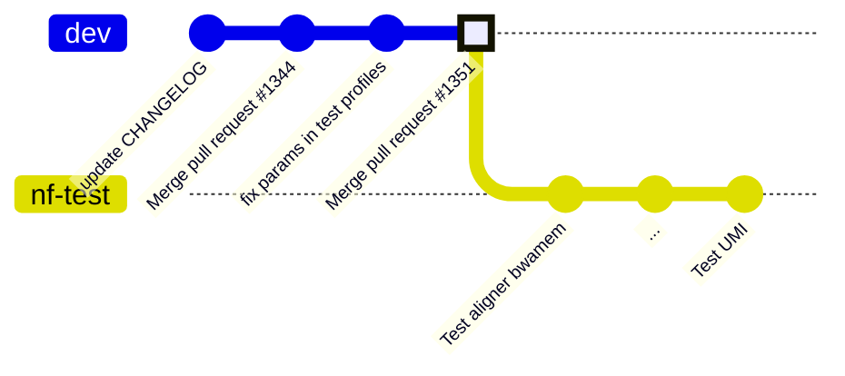

```yaml
layout: center
```



<SarekWatermark/>

<!-- Let's say you're going to convert all of the sarek workflow tests to nf-test -->

---

```yaml
layout: center
```

# 100 subworkflows later...

<!-- TODO -->

---

```yaml
transition: slide-up
layout: center
```



<SarekWatermark/>

---

```yaml
title: A wild Maxime
layout: image
image: https://i.imgflip.com/88xfmj.jpg
backgroundSize: contain
```

<!-- Oh no! A wild Maxime appeared!  -->

---

```yaml
layout: center
```



<SarekWatermark/>

---

```yaml
title: So you hit the update branch button...
layout: image
backgroundSize: contain
image: https://github.blog/wp-content/uploads/2015/09/82df93f2-5030-11e5-84ec-ea15e16ed887.png
```

---

```yaml
layout: center
```



<SarekWatermark/>
<!-- "Merge dev" -->

---

```yaml
layout: center
```



<SarekWatermark/>
<!-- What we're trying to prevent -->

---

```yaml
title: Perfect Rebase gif
layout: image
image: https://blog.mralx.com/d47851d6ea6094c1eaf433e8da6d6656/rebase.gif
backgroundSize: contain
```

<!-- https://blog.mralx.com/git-rebase/ -->

---



`git rebase origin/dev`

<SarekWatermark/>

---

## Merge


## Rebase


<!-- - Which one would you rather review? -->

<SarekWatermark/>

---

```yaml
title: So you hit the update branch button...
layout: image
backgroundSize: contain
```

<video controls autoplay="true">
   <source src="https://user-images.githubusercontent.com/2503052/152357644-6484dc2b-4aae-4977-b76c-b284c5388d7b.mp4" type="video/mp4" alt="Update branch button" >
</video>
