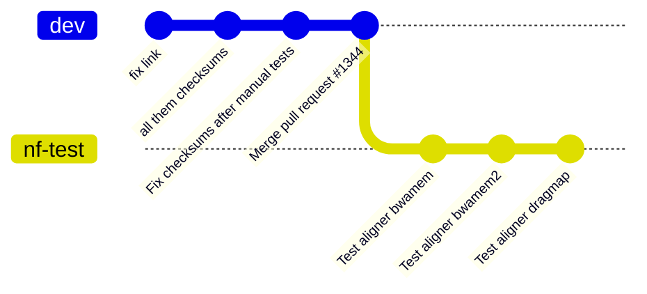
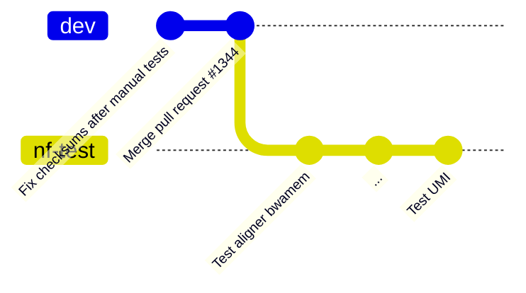
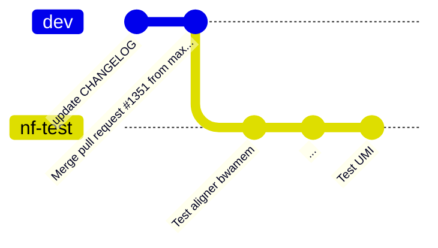
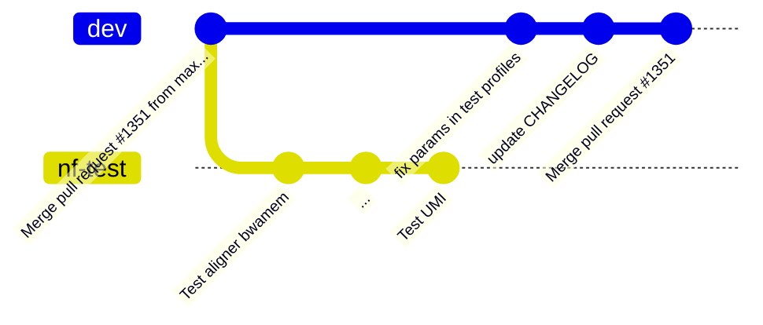
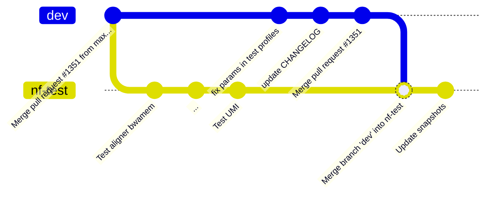
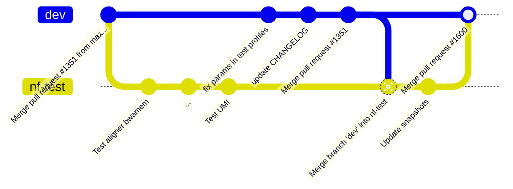
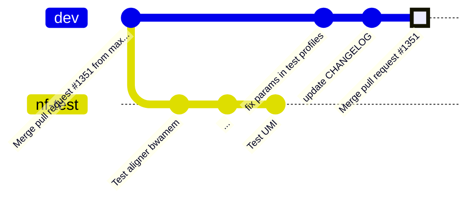
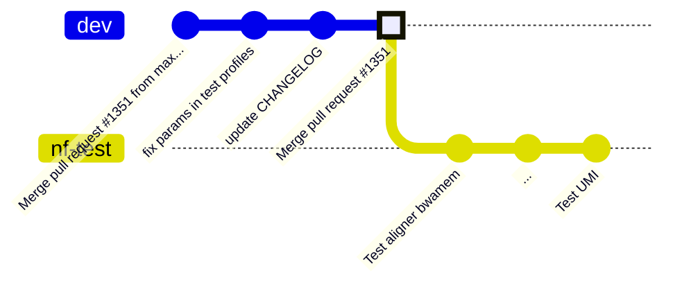

```yaml
template: section
```

# `git rebase`

- The concept
- With pull
- Interactive rebase

---

# `git rebase`

<video controls>
   <source src="/rebase_interactive_gitlens.webm" type="video/webm">
</video>

# `git rebase`



<!-- Let's say you're going to convert all of the sarek workflow tests to nf-test -->

---

# 100 subworkflows later...

<!-- TODO -->

---



- You did it!

---



---

```yaml
layout: image

# A wild Maxime
image: https://imgflip.com/i/88xfmj
```

<!-- Oh no! A wild Maxime appeared!  -->

---



---

# Swiper no merging!



<!-- "Merge dev" -->

---

# What we're trying to prevent



---

# Linear history



<!-- Let's go back to before we merged dev -->

---



`git rebase origin/dev`

---

# Before


# After


---

## Merge


## Rebase


---

```yaml
title: Simple Rebase Rules
layout: image
image: https://wizardzines.com/images/uploads/46d480e3f5029644.png
```

<!-- cite: https://wizardzines.com/comics/rules-for-rebasing/ -->

---

```yaml
title: Simple Rebase Rules
layout: image
image: https://blog.mralx.com/d47851d6ea6094c1eaf433e8da6d6656/rebase.gif
```

<!-- https://blog.mralx.com/git-rebase/ -->

---
